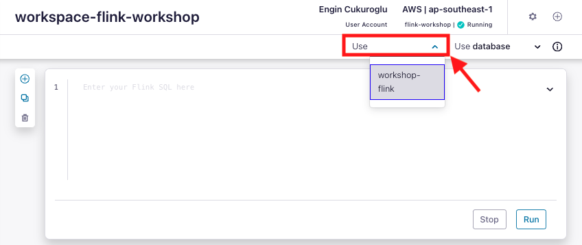

## README Template

    

 

## **Agenda**
1. [Log into Confluent Cloud]
2. [Create an Environment and Cluster]
3. [Create Flink Compute Pool]
4. [Create Topics and walk through Confluent Cloud Dashboard]
5. [Create an API Key Pair]
6. [Clean Up Resources](#step-15)

***

## **Prerequisites**
 

1. Create a Confluent Cloud Account.
    - Sign up for a Confluent Cloud account [here](https://www.confluent.io/confluent-cloud/tryfree/).
    - Once you have signed up and logged in, click on the menu icon at the upper right hand corner, click on “Billing & payment”, then enter payment details under “Payment details & contacts”. A screenshot of the billing UI is included below.

> **Note:** You will create resources during this workshop that will incur costs. When you sign up for a Confluent Cloud account, you will get free credits to use in Confluent Cloud. This will cover the cost of resources created during the workshop. More details on the specifics can be found [here](https://www.confluent.io/confluent-cloud/tryfree/).

    

***

## Log into Confluent Cloud

1. Log into [Confluent Cloud](https://confluent.cloud) and enter your email and password.

    

2. If you are logging in for the first time, you will see a self-guided wizard that walks you through spinning up a cluster. Please minimize this as you will walk through those steps in this workshop. 

***

## Create an Environment and Cluster

An environment contains clusters and its deployed components such as Apache Flink, Connectors, ksqlDB, and Schema Registry. You have the ability to create different environments based on your company's requirements. For example, you can use environments to separate Development/Testing, Pre-Production, and Production clusters. 

1. Click **+ Add Environment**. Specify an **Environment Name** and Click **Create**. 

>**Note:** There is a *default* environment ready in your account upon account creation. You can use this *default* environment for the purpose of this workshop if you do not wish to create an additional environment.

    

When it is asked to upgrade for more advanced Stream Governance capabilities, click **Not now, continue with Stream Governance Essentials for free**.

    

2. Click **Create Cluster**. 

> **Note:** Confluent Cloud clusters are available in 4 types: Basic, Standard, Enterprise and Dedicated. Basic is intended for development use cases so you will use that for the workshop. Basic clusters only support single zone availability. Standard and Dedicated clusters are intended for production use and support Multi-zone deployments. If you are interested in learning more about the different types of clusters and their associated features and limits, refer to this [documentation](https://docs.confluent.io/current/cloud/clusters/cluster-types.html).

5. Chose the **Basic** cluster type. 

    

6. Click **Begin Configuration**. 
7. Select **AWS** as the provider and **eu-west-2** as the region, with single zone.
8. Specify a **Cluster Name**. For the purpose of this lab, any name will work here. 

    

> **Note** If you didn't enter credit card information at the beginning, it may ask you to enter credit card information at **Set Payment** step. When you sign up for a Confluent Cloud account, you will get free credits to use in Confluent Cloud.

    

9. View the associated *Configuration & Cost*, *Usage Limits*, and *Uptime SLA* information before launching. 
10. Click **Launch Cluster**. 

***

## Create a Flink Compute Pool

1. On the navigation menu, select **Flink** and click **Create Compute Pool**.

    

2. Select **AWS** as the provider and **eu-west-2** as the region then click **Continue**.

    

3. Name you Pool Name and set the capacity units (CFUs) to **5**. Click **Finish**.

    

> **Note:** The capacity of a compute pool is measured in CFUs. Compute pools expand and shrink automatically based on the resources required by the statements using them. A compute pool without any running statements scale down to zero. The maximum size of a compute pool is configured during creation. 

4. Flink Compute pools will be ready shortly. You can click **Open SQL workspace** when the pool is ready to use.

    

5. Change your workspace name by clicking **settings button**. Click **Save changes** after you update the workspace name.

    

6. Set the default Catalog as your environment name.

    

7. Set the default Database as your cluster name.

    

***

## Creates Topic and Walk Through Cloud Dashboard

1. On the navigation menu, you will see **Cluster Overview**. 

> **Note:** This section shows Cluster Metrics, such as Throughput and Storage. This page also shows the number of Topics, Partitions, Connectors, and ksqlDB Applications.  Below is an example of the metrics dashboard once you have data flowing through Confluent Cloud. 

    

2. Click on **Cluster Settings**. This is where you can find your *Cluster ID, Bootstrap Server, Cloud Details, Cluster Type,* and *Capacity Limits*.
3. On the same navigation menu, select **Topics** and click **Create Topic**. 
4. Enter **shoe_products** as the topic name, **3** as the number of partitions, and then click **Create with defaults**. 

    

5. Repeat the previous step and create a second topic name **shoe_customers** and **3** as the number of partitions.
   
6. Repeat the previous step and create a second topic name **shoe_orders** and **3** as the number of partitions.

> **Note:** Topics have many configurable parameters. A complete list of those configurations for Confluent Cloud can be found [here](https://docs.confluent.io/cloud/current/using/broker-config.html). If you are interested in viewing the default configurations, you can view them in the Topic Summary on the right side. 

7. After topic creation, the **Topics UI** allows you to monitor production and consumption throughput metrics and the configuration parameters for your topics. When you begin sending messages to Confluent Cloud, you will be able to view those messages and message schemas.
8. Below is a look at the topic, **shoe_orders**, but you need to send data to this topic before you see any metrics.

    

***

## Create an API Key

1. Click **API Keys** on the navigation menu. 
2. Click **Create Key** in order to create your first API Key. If you have an existing API Key select **+ Add Key** to create another API Key.

    

3. Select **Global Access** and then click **Next**. 
4. Copy or save your API Key and Secret somewhere. You will need these later on in the lab, you will not be able to view the secret again once you close this dialogue. 
5. After creating and saving the API key, you will see this API key in the Confluent Cloud UI in the **API Keys** section. If you don’t see the API key populate right away, refresh the browser.

***

## Clean Up Resources

Deleting the resources you created during this workshop will prevent you from incurring additional charges. 

1. The first item to delete is the Apache Flink Compute Pool. Select the **Delete** button under **Actions** and enter the **Application Name** to confirm the deletion. 

    

2. Finally, under **Cluster Settings**, select the **Delete Cluster** button at the bottom. Enter the **Cluster Name** and select **Confirm**. 

    

*** 
